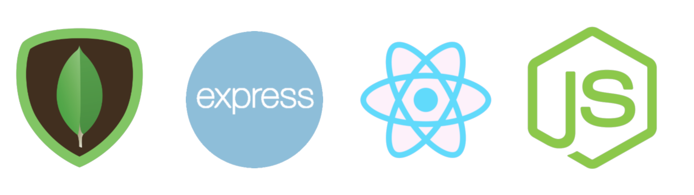

<h1 align="center">
    MERN Boilerplate
    <br>
    <br>
    
</h1>

<p align="center">
    <h4 align="center">React nicely featured (Babel, Webpack, Redux) App, with Node/Express Backend, and Mongo Database all within Docker's container</h4>
</p>

<p align="center">
    <a href="https://www.npmjs.com/"></a>
    <a href="https://reactjs.org/"></a>
    <a href="https://babeljs.io/"></a>
    <a href="https://expressjs.com/"></a>
    <a href="https://www.paypal.me/baylesa"></a>
</p>

<p align="center">
  <a href="#installation">Installation</a> •
  <a href="#usage">Usage</a> •
  <a href="#technologies">Technologies</a> •
  <a href="#sources-and-related">Sources and Related</a>
</p>

## Installation
* ### Prerequisites

    **Install *docker* and *docker-compose***

    Due to the large number of available platforms I would refer you to the clear, clean and well explained Docker website.

    :point_down: Follow the links above :point_down:

    |[](https://docs.docker.com/install/) | [**Install Docker**](https://docs.docker.com/install/)|
    -----------------------------------|-------------------------------------------------------

## Usage
* ### Build Docker's containers
    ```bash
    $ docker-compose build
    ```
* ### Launch Docker's containers
    ```bash
    $ docker-compose up
    ```
And that's it, you can code :thumbsup: :tada:

## Technologies

* [**MongoDB**](https://www.mongodb.com/) Open Source Document Database 
    > 
    >
    >*For giant ideas*
* [**Express**](https://expressjs.com/) Node.js web application framework
    > 
    >
    >*Fast, unopinionated, minimalist web framework for Node.js*
* [**React**](https://reactjs.org/) A JavaScript library for building user interfaces
    > 
    >
    > *Declarative, efficient, and flexible*
* [**Node.js**](https://nodejs.org/en/) JavaScript runtime built on Chrome's V8 JavaScript engine
    > 
    >
    >*Designed to build scalable network applications*
* [**Docker**](https://www.docker.com/) Enterprise Container Platform
    > 
    >
    >*Protect your legacy, invest in your future*

## Sources and Related