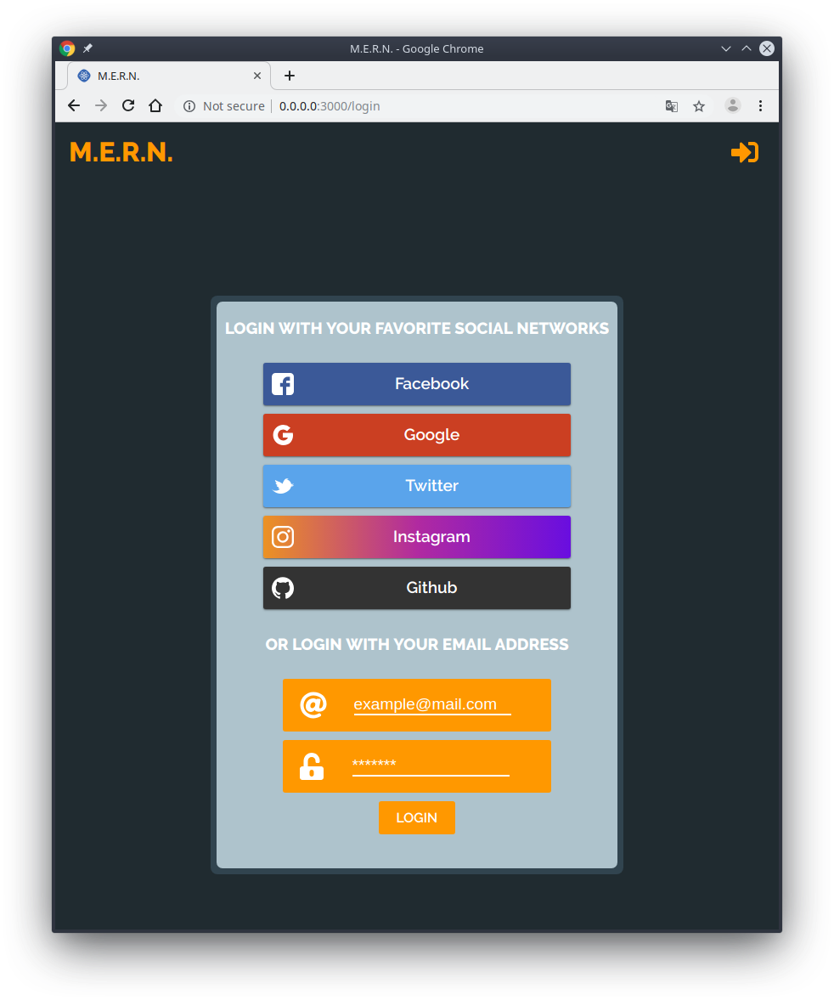

<h1 align="center">
    MERN Boilerplate
    <br>
    <br>
    
</h1>

<p align="center">
    <h4 align="center">React nicely featured (Babel, Webpack, Redux) App, with Node/Express Backend, and Mongo Database all within Docker's container</h4>
</p>

<p align="center">
    <a href="https://www.npmjs.com/"></a>
    <a href="https://reactjs.org/"></a>
    <a href="https://babeljs.io/"></a>
    <a href="https://expressjs.com/"></a>
    <a href="https://www.paypal.me/baylesa"></a>
</p>

<p align="center">
  <a href="#installation">Installation</a> •
  <a href="#usage">Usage</a> •
  <a href="#how-to-use">How to use</a>
  <a href="#technologies">Technologies</a> •
  <a href="#sources-and-related">Sources and Related</a>
</p>

## Installation
### Prerequisites

**Install *docker* and *docker-compose***

Due to the large number of available platforms I would refer you to theclear, clean and well explained Docker website.

:point_down: Follow the links above :point_down:

|[](https://docs.docker.com/install/) | [**Install Docker**](https://docs.docker.com/install/)|
-----------------------------------|-------------------------------------------------------

## Usage
##### Generate SSL Certificate
To run this project with **HTTPS**, and use Facebook Login feature, you have to generate certificates.
You can follow this tutorial, created by **Daksh Shah** :

| | [www.medium.freecodecamp.org/how-to-get-https-working-on-your-local-development-env...](https://medium.freecodecamp.org/how-to-get-https-working-on-your-local-development-environment-in-5-minutes-7af615770eec) |
----------------------------------------------------|-----------------------------------------

```bash
$ mkdir -p MERN-Boilerplate/server/certs
```
And place your server.key, server.crt and server.csr under server/certs/

__If you don't want to use HTTPS__

* in _server/server.js_ and _client/src/containers/Login.js_ comment/uncomment
    ```javascript
    //const server = http.createServer(app)
    const server = https.createServer(certOptions, app)

    //const API_URL = "http://localhost:8080"
    const API_URL = "https://localhost:8080"
    ```
* in _client/config/webpack.base.config.js_ remove
    ```json
    devServer: {
        https: true,
        [...]
    }
    ```
##### Want to use social media login ?

Refer to the <a href="#social-media-login">Social Media Login</a> chapter :v: :point_down:

##### Build Docker's containers with
```bash
$ docker-compose build
```
##### Launch Docker's containers with
```bash
$ docker-compose up
```
##### Open your favorite browser on
```bash
https://localhost:3000
```
###### And that's it, you can code :thumbsup: :tada:
###### This is what you should see :point_down:


## Social Media Login

To use social media login, you have to follow few steps :

* Submit to a developper account on the following websites :

    * [www.developers.facebook.com](https://developers.facebook.com/)
    * [www.developer.twitter.com/](https://developer.twitter.com/)
    * [www.console.developers.google.com/](https://console.developers.google.com/)
    * [www.instagram.com/developer/](https://www.instagram.com/developer/)
    * [www.github.com/settings/developers](https://github.com/settings/developers)

* Get __CLIENT_ID__ and __CLIENT_SECRET__ and place them in a _server/.env_ file as
    ```javascript
    GOOGLE_KEY=''
    GOOGLE_SECRET=''
    ```

## How to use

### Architecture
    .
    ├── client                   # Client sources
    │   ├── config               # Webpack configuration files
    │   ├── src                  # Sources files
    │   │   ├── action           #
    │   │   ├── reducers         # Redux configuration files
    │   │   ├── store            #
    │   │   ├── components       # React components
    │   │   ├── containers       # React containers
    │   │   └── stylesheets      # SASS Styles files
    │   ├── .babelrc             # Babel configation file
    │   └── Dockerfile           # Client Dockerfile
    ├── sever                    # Back-end sources
    └── docker-compose.yml       # Docker Compose (client, backend, mongodb)
### Client

### Server

## Technologies

* [**MongoDB**](https://www.mongodb.com/) Open Source Document Database 
    > 
    >
    >*For giant ideas*
* [**Express**](https://expressjs.com/) Node.js web application framework
    > 
    >
    >*Fast, unopinionated, minimalist web framework for Node.js*
* [**React**](https://reactjs.org/) A JavaScript library for building user interfaces
    > 
    >
    > *Declarative, efficient, and flexible*
* [**Node.js**](https://nodejs.org/en/) JavaScript runtime built on Chrome's V8 JavaScript engine
    > 
    >
    >*Designed to build scalable network applications*
* [**Docker**](https://www.docker.com/) Enterprise Container Platform
    > 
    >
    >*Protect your legacy, invest in your future*

## Sources and Related